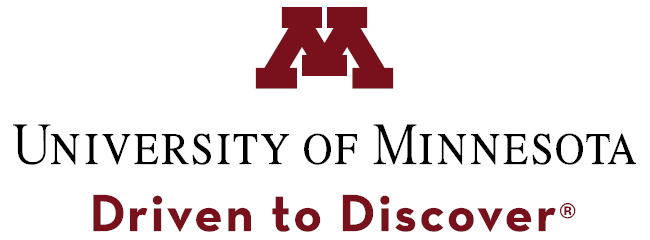



**Ph.D candidate, University of Minnesota - Twin Cities (UMN)**

- [School of Physics and Astronomy](https://cse.umn.edu/physics), 2016-

  - Typical classes taken: classical physics, quantum mechanics, solid state physics, advanced quantum physics, advanced topics in condensed matter, mathematical methods in physics, etc.

  - Grad Phi Officer (2017-2018); Women in Physics and Astronomy Officer (2017-2018, 2019-2020)

  - Teaching assistance experience: leading problem-solving based labs and discussions for undergraduate and graduate level courses in various topics: mechanics, electromagnetism, optics, special relativity, thermal and statistical physics, best practices in physics teaching.

  - [Research work](https://faystransition.github.io/research/)

**B.S., Sun Yat-sen University (SYSU)**

- [School of Physics and Engineering (now School of Physics)](http://spe.sysu.edu.cn/) - National base for talent training in physics, 2011-2015

  - Typical classes taken: advanced mathematics, linear algebra, probability and statistics, mechanics, thermodynamics, optics, quantum mechanics, electrodynamics, atomic physics, methods of mathematical physics, advanced algorithms, circuits and electronics

- [Yat-sen School](http://yss.sysu.edu.cn/) - Training program for top students in basic sciences，2012-2015

- SYSU - ENS (Ecole Normale Superieure) program - International theoretical physics class, 2013-2014

  - Typical classes taken: statistical field theory, contemporary semiconductor physics, nonlinear and quantum optics, introduction for group theory, quantum field theory

- [Research work](https://faystransition.github.io/research/)

**University of Cologne**, exchange program, 2014

- Master program classes: computational many body physics, quantum field theory

**Peking University**, summer school, 2013

 

---

# Selected honors and awards

&nbsp;&nbsp; See this [page](https://faystransition.github.io/honors).

 

---

# E-learning and certificates



Learning as a life long journey continues!
